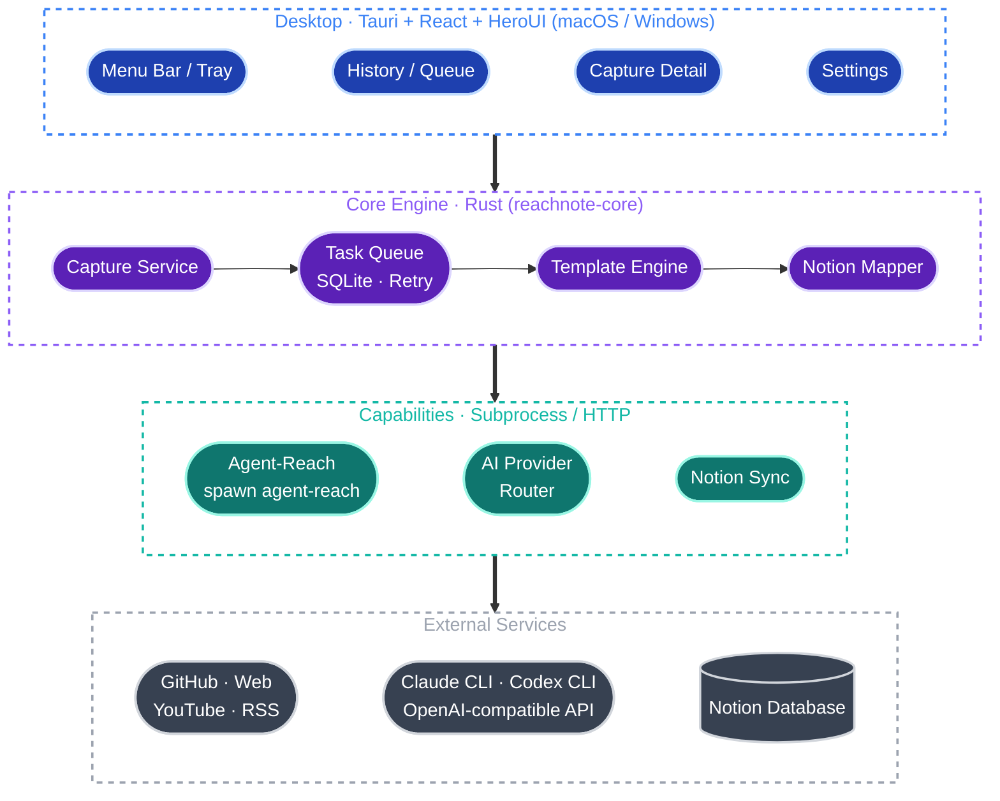
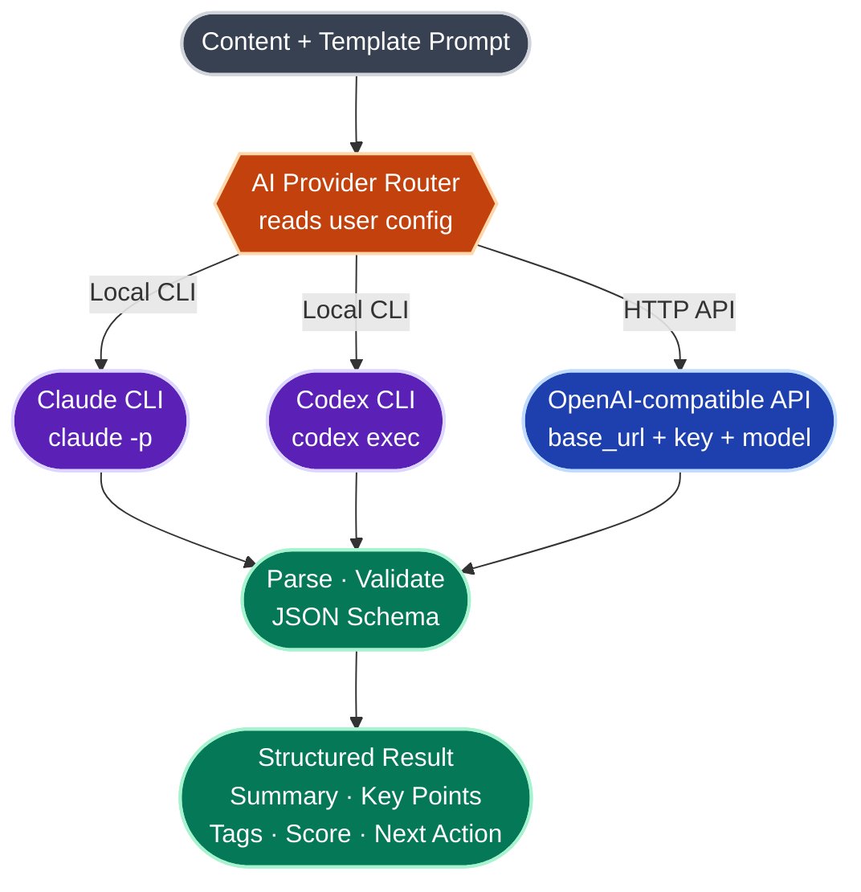
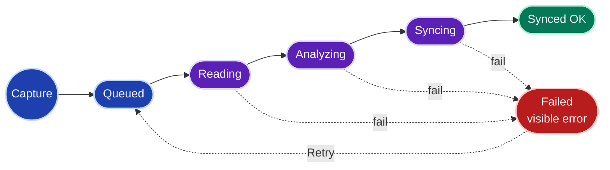
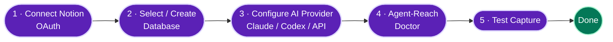

<h1 align="center">ReachNote</h1>

<p align="center"><b>AI-powered web capture for Notion</b></p>
<p align="center">Turn what you browse into reusable Notion research cards.</p>

<p align="center">
  <b>English</b> | <a href="README.zh-CN.md">简体中文</a>
</p>

<p align="center">
  <a href="LICENSE"></a>
  
  
  <a href="https://heroui.com"></a>
  <a href="https://github.com/Panniantong/Agent-Reach"></a>
  
  <a href="https://github.com/AliceDel66/ReachNote/stargazers"></a>
</p>

> ReachNote is a **cross-platform (macOS / Windows) desktop AI capture tool**. While browsing GitHub, the web, videos, or RSS, you grab a link with one shortcut — a local agent reads the content, runs an AI analysis, and writes a structured card into your bound Notion database, building a personal research library that stays searchable and comparable over time.

> [!NOTE]
> **Status: early development (Pre-Alpha).** Product scope, information architecture and tech stack are settled; core code is in progress. The P0 vertical slice already runs (URL → AI analysis → structured card). Sections marked *planned / in progress* describe the target shape and are not fully implemented yet.

---

## Table of Contents

- [What is ReachNote](#what-is-reachnote)
- [Features](#features)
- [The Core Flow](#the-core-flow)
- [Architecture](#architecture)
- [AI Analysis: Three Providers](#ai-analysis-three-providers)
- [Capture Methods](#capture-methods)
- [Task Lifecycle](#task-lifecycle)
- [Tech Stack](#tech-stack)
- [Project Structure](#project-structure)
- [Getting Started](#getting-started)
- [Configuration](#configuration)
- [Notion Database Schema](#notion-database-schema)
- [Built-in AI Templates](#built-in-ai-templates)
- [Roadmap](#roadmap)
- [Privacy & Data](#privacy--data)
- [Acknowledgements](#acknowledgements)
- [Contributing](#contributing)
- [License](#license)

---

## What is ReachNote

Saving is easy; revisiting never happens. ReachNote tackles three broken links in how we consume information:

1. **You find great content, then never organize it.** Bookmarks rot into a digital landfill.
2. **AI can summarize, but lacks stable cross-platform reading.** Copy-pasting is tedious, and many pages can't even be read cleanly.
3. **Notion is the ideal long-term knowledge base, but manual entry, tagging and classification are too heavy.**

ReachNote automates this chain. It is not "yet another bookmarking app" — it is:

> **When I see a link worth studying, I don't organize it by hand — one shortcut turns it into a structured Notion research card I can later search, compare and follow up on.**

The first release focuses on **developers / AI-tooling researchers**: GitHub repos, technical blogs, YouTube tutorials and RSS updates are frequent, stable sources whose output maps naturally onto a Notion database (positioning, tech stack, value judgment, follow-up).

---

## Features

| Feature | Description |
| --- | --- |
| 💻 **Cross-platform desktop** | macOS and Windows, tray / menu-bar resident, built on Tauri with a light idle footprint |
| 🖱️ **One-shortcut capture** | Clipboard URL, manual paste, global hotkey (planned) |
| 🌐 **Multi-source reading** | Reads GitHub / web / YouTube transcripts / RSS via [Agent-Reach](https://github.com/Panniantong/Agent-Reach), with content extraction + denoising |
| 🤖 **Templated AI analysis** | Not just a summary — structured fields by content type: positioning, tech stack, key points, value score, next action |
| 🔌 **Three AI providers** | Local **Claude CLI** / local **Codex CLI** / any **OpenAI-compatible API** — bring your own compute and keys |
| 🗂️ **Direct to Notion** | OAuth, automatic field mapping, written into the database you choose |
| 🔁 **Local queue & retry** | Tasks persist locally; failures are human-readable and one-click retryable |
| 🔐 **Local-first / privacy-friendly** | Content flows only "your machine → your AI → your Notion", no middle server |
| 🆓 **Open source / BYOK** | MIT, no cloud account, no subscription, works with your own keys |

---

## The Core Flow

ReachNote's entire value is turning every link reliably into a usable Notion research card:

```mermaid
flowchart LR
    classDef io fill:#374151,stroke:#d1d5db,stroke-width:2px,color:#fff
    classDef capture fill:#1e40af,stroke:#bfdbfe,stroke-width:2px,color:#fff
    classDef read fill:#0f766e,stroke:#99f6e4,stroke-width:2px,color:#fff
    classDef ai fill:#5b21b6,stroke:#ddd6fe,stroke-width:2px,color:#fff
    classDef sync fill:#047857,stroke:#a7f3d0,stroke-width:2px,color:#fff

    URL((URL)):::io
    URL --> Capture(["1 · Capture<br/>Clipboard / Hotkey / Manual"]):::capture
    Capture --> Detect(["2 · Detect Source<br/>GitHub · Web · Video · RSS"]):::capture
    Detect --> Read(["3 · Read<br/>via Agent-Reach"]):::read
    Read --> Clean(["4 · Clean<br/>Extract · Denoise"]):::read
    Clean --> Analyze(["5 · Analyze<br/>AI Template"]):::ai
    Analyze --> Map(["6 · Map<br/>Notion Fields"]):::sync
    Map --> Sync(["7 · Sync<br/>Write to Notion"]):::sync
    Sync --> Done((Done)):::sync
```



> Design principle: the point is not "how many platforms we scrape" but that `GitHub / web / YouTube → AI template → Notion database` works reliably for every single item.

---

## Architecture

ReachNote is a **local-first**, cross-platform desktop app in four layers:



- **Desktop layer** (Tauri + React + HeroUI): menu bar / tray, History / Queue, Capture Detail, Settings. History / Queue is the first screen.
- **Core engine** (Rust): local orchestration. Capture service → persistent queue with retry → template engine builds the prompt → Notion mapper aligns fields.
- **Capabilities**: three outward adapters — Agent-Reach (spawns `agent-reach` to read), AI Provider router (analysis), Notion Sync (writes cards).
- **External services**: content sources, AI backends, your Notion database — all under your control.

---

## AI Analysis: Three Providers

A core design choice is **Bring Your Own Compute**. AI analysis is not tied to any single vendor — pick one of three:



| Provider | How it's called | Best for | What you provide |
| --- | --- | --- | --- |
| **Claude CLI** | local subprocess `claude -p` | already using Claude Code, want to reuse its login & quota | install & log into [Claude Code CLI](https://claude.com/claude-code) |
| **Codex CLI** | local subprocess `codex exec` | already using OpenAI Codex CLI | install & log into [Codex CLI](https://github.com/openai/codex) |
| **OpenAI-compatible API** | HTTP request | official / proxy / local inference | `base_url` + `api_key` + `model` |

> **Why local CLIs?** Many developers already have Claude / Codex CLI installed and logged in. ReachNote reuses them as subprocesses, so you **don't configure a separate API key** and content never passes through a third party. The OpenAI-compatible mode covers everything else — including local inference endpoints (Ollama `http://localhost:11434/v1`, LM Studio `http://localhost:1234/v1`) for fully offline use.

Either way, ReachNote asks the model for the **same structured output**, validated against a JSON schema, so it maps cleanly onto Notion fields. See [Configuration](#configuration).

---

## Capture Methods

| Method | Description | Priority |
| --- | --- | --- |
| 📋 Clipboard URL | detect a link in the clipboard, capture in one click | P0 |
| ⌨️ Manual paste | paste any URL into a popup | P0 |
| 🔥 Global hotkey | capture from any app | P1 |
| 🌍 Current browser URL | grab the page the foreground browser is on | P1 |

---

## Task Lifecycle

Each captured task moves through these states in the local queue. **Failures are never silently dropped** — errors are readable and one-click retryable:



> Two distinct state sets: the diagram shows the **in-app task processing state**; once in Notion, a card also has a **content lifecycle state** (`Inbox / Reviewing / Follow-up / Archived`) that you advance manually.

---

## Tech Stack

The stack is settled — decided jointly by three constraints: cross-platform, always-resident, and the required HeroUI.

| Layer | Choice |
| --- | --- |
| App shell | **Tauri 2** (cross-platform macOS / Windows) |
| Frontend | **React 18** + TypeScript + Vite |
| UI components | **HeroUI** + Tailwind CSS |
| Core backend | **Rust** (`reachnote-core`, unit-tested) |
| Persistence | SQLite |
| Credential storage | OS keychain (keyring) |
| Distribution | Tauri bundler → `.dmg` / `.msi` |

> **Why Tauri over Electron:** ReachNote is a resident tray app and sensitive to idle memory. Tauri reuses the system WebView (WKWebView on macOS, WebView2 on Windows), so the resident process is far lighter than Electron bundling a full Chromium per app. **The frontend is React** because HeroUI is a React component library. AI and reading are both orchestrated from Rust via subprocesses (`agent-reach` / `claude` / `codex`) and HTTP.

---

## Project Structure

```text
rearchnote/
├─ crates/core/        # reachnote-core: pure-logic core (Rust, unit-tested)
│  └─ src/
│     ├─ ai/           # AI provider abstraction: claude-cli / codex-cli / openai-api + parsing
│     └─ reach.rs      # wraps calls to the Agent-Reach CLI
├─ src-tauri/          # Tauri shell: capture command, tray, persistence
├─ src/                # React + HeroUI frontend (minimal capture UI)
├─ Cargo.toml          # Rust workspace
└─ package.json        # frontend deps + Tauri CLI
```

---

## Getting Started

> [!IMPORTANT]
> Early stage. The **P0 vertical slice** runs today: enter a URL (or paste content directly) → call an AI provider → get a structured card. Notion writing, tray and queue persistence are still in progress.

### Prerequisites

- **Rust** (stable) and **Node 18+** / **pnpm**
- At least one AI provider: local `claude` / `codex` CLI, or an OpenAI-compatible API `base_url` + `api_key`
- Reading: [Agent-Reach](https://github.com/Panniantong/Agent-Reach) (`agent-reach` CLI; Python runtime on Windows)
- A Notion account (for writing; in progress)

### Run

```bash
git clone git@github.com:AliceDel66/ReachNote.git
cd ReachNote
pnpm install
pnpm tauri dev
```

### First-run setup (Onboarding)

Goal: **first working loop in under 2 minutes.**



1. **Connect Notion** — OAuth into the target workspace.
2. **Select or create a database** — pick one, or create the default `ReachNote Research Inbox`.
3. **Configure an AI provider** — one of the three.
4. **Run Agent-Reach Doctor** — i.e. `agent-reach doctor`, to check reading channels.
5. **Test a capture** — grab a GitHub repo and confirm the full chain works.

---

## Configuration

> The shape below is **the design target** (tentative path `~/.reachnote/config.toml`). Most users can do this in Settings — no hand-editing required.

```toml
[ai]
# one of: claude-cli | codex-cli | openai-api
provider = "claude-cli"

[ai.claude-cli]
command = "claude"        # reuse the logged-in Claude Code

[ai.codex-cli]
command = "codex"

[ai.openai-api]
base_url = "https://api.openai.com/v1"   # for local inference: http://localhost:11434/v1, etc.
api_key  = "sk-..."
model    = "gpt-4o-mini"

[reach]
command = "agent-reach"   # Agent-Reach CLI
sources = ["github", "web", "youtube", "rss"]

[notion]
# written automatically by the OAuth flow
database_id = "xxxxxxxx-xxxx-xxxx-xxxx-xxxxxxxxxxxx"
default_template = "github-project"
```

---

## Notion Database Schema

Default database: **`ReachNote Research Inbox`**

| Field | Type | Notes |
| --- | --- | --- |
| `Title` | Title | content title |
| `URL` | URL | original link |
| `Source Type` | Select | `GitHub` / `Article` / `Video` / `RSS` / `Social` |
| `Summary` | Text | AI summary |
| `Key Points` | Text | key takeaways |
| `Tags` | Multi-select | auto-tagged |
| `Status` | Select | `Inbox` / `Reviewing` / `Follow-up` / `Archived` |
| `Score` | Number | value score (0-100) |
| `Captured At` | Date | capture time |
| `Synced At` | Date | write time |
| `AI Model` | Text | model / provider actually used |
| `Template` | Select | analysis template used |
| `Raw Content` | Text | cleaned source text |
| `Next Action` | Text | suggested next step |

---

## Built-in AI Templates

Templates define the structure of the AI output. Four ship in the first release, auto-selected by source (manual selection in P1):

| Template | Source | Output fields |
| --- | --- | --- |
| **GitHub Project Analysis** | GitHub repo | positioning · features · tech stack · use cases · highlights · risks · worth following |
| **Article Reading Note** | blog / web | one-line summary · key points · evidence · reusable takeaways · tags |
| **Video Note** | YouTube transcript | topic · chapter summary · key points · action items · who it's for |
| **RSS Brief** | RSS / feed | what's new · why it matters · category tags · needs follow-up reading |

---

## Roadmap

### P0 — MVP loop

- [x] AI provider abstraction (Claude CLI / Codex CLI / OpenAI-compatible API) + unit tests
- [x] Source detection and template routing
- [ ] Notion OAuth + database select / create
- [ ] Manual / clipboard URL capture
- [ ] Agent-Reach reading integration (align with real subcommand)
- [ ] Notion writing
- [ ] Local task queue + failure retry

### P1 — Experience

- [ ] Global hotkey / current-browser-URL capture
- [ ] Template selection
- [ ] Agent-Reach Doctor UI
- [ ] Simple batch processing

### P2 — Monitoring

- [ ] Scheduled RSS monitoring / GitHub repo watch
- [ ] Weekly / monthly digests
- [ ] Custom Notion field mapping
- [ ] Logged-in social channels (XiaoHongShu / Twitter / Reddit, already supported by Agent-Reach)

> **Deliberately out of scope** for v1: large-scale social scraping, team knowledge bases, a self-hosted cloud content store, full RAG search, two-way Notion sync, a complex template editor.

---

## Privacy & Data

ReachNote is a **local-first** open-source tool. There is no cloud account and no ReachNote server.

- **Content flows only three ways:** your machine → your AI provider → your Notion. No third-party relay.
- **Bring your own keys (BYOK):** API keys and Notion credentials live in the OS keychain locally, never uploaded.
- **Can be fully offline:** with a local CLI or local inference (Ollama / LM Studio), content never leaves your machine.
- **Failures are visible:** tasks and errors stay local and are never silently dropped.

---

## Acknowledgements

ReachNote stands on the shoulders of:

- **[Agent-Reach](https://github.com/Panniantong/Agent-Reach)** — the cross-platform reading layer that lets ReachNote "see the internet" (GitHub / web / YouTube / RSS and more).
- **[HeroUI](https://heroui.com)** — the React UI component library.
- **[Tauri](https://tauri.app)** — the cross-platform desktop shell.

---

## Contributing

ReachNote is early — **the best time to help shape it.**

- 💡 Ideas / use cases / source requests → open a [Discussion](https://github.com/AliceDel66/ReachNote/discussions)
- 🐛 Bugs / design gaps → file an [Issue](https://github.com/AliceDel66/ReachNote/issues)
- 🔧 Want to code → look at P0 in the roadmap and pick something up

---

## License

Planned to be released under the **[MIT License](LICENSE)** — no commercialization plans, free to use, modify and distribute.

---

<p align="center">
  <sub>Built for people who collect more than they read.</sub><br/>
  <sub>ReachNote · <a href="https://github.com/AliceDel66/ReachNote">github.com/AliceDel66/ReachNote</a></sub>
</p>
