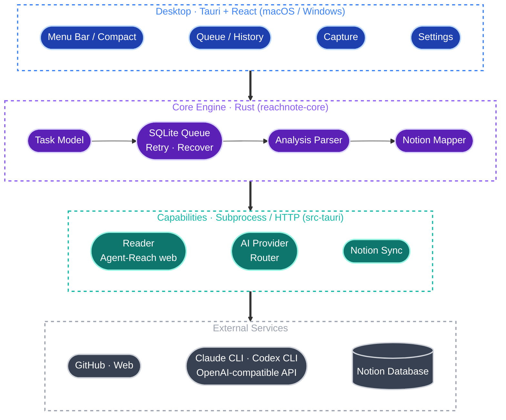
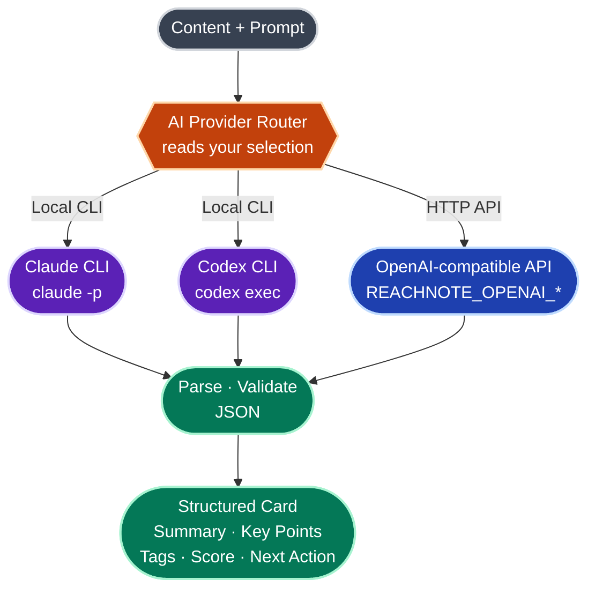
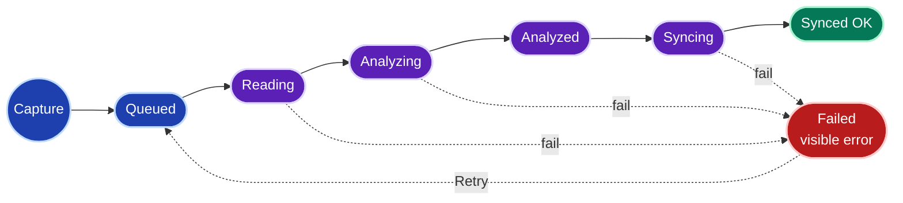
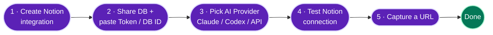

<h1 align="center">ReachNote</h1>

<p align="center"><b>AI-powered web capture for Notion</b></p>
<p align="center">Turn what you browse into reusable Notion research cards.</p>

<p align="center">
  <b>English</b> | <a href="README.zh-CN.md">简体中文</a>
</p>

<p align="center">
  <a href="LICENSE"></a>
  
  
  
  <a href="https://github.com/Panniantong/Agent-Reach"></a>
  
  <a href="https://github.com/AliceDel66/ReachNote/releases"></a>
  <a href="https://github.com/AliceDel66/ReachNote/stargazers"></a>
</p>

> ReachNote is a **cross-platform (macOS / Windows) desktop AI capture tool**. While browsing GitHub, the web, videos, or RSS, you grab a link — a local agent reads the content, runs an AI analysis, and writes a structured card into your bound Notion database, building a personal research library that stays searchable and comparable over time.

> [!NOTE]
> **Status: Alpha.** The core loop — capture → read → AI analysis → Notion sync — runs end to end with a local SQLite queue and one-click retry. Some P1 items (Notion OAuth, global hotkey, template editing, OS keychain, code signing) are not done yet; see the [Roadmap](#roadmap). Grab a build from [Releases](https://github.com/AliceDel66/ReachNote/releases) or run from source.

---

## Table of Contents

- [What is ReachNote](#what-is-reachnote)
- [Download & Install](#download--install)
- [Features](#features)
- [The Core Flow](#the-core-flow)
- [Architecture](#architecture)
- [AI Analysis: Three Providers](#ai-analysis-three-providers)
- [Capture Methods](#capture-methods)
- [Task Lifecycle](#task-lifecycle)
- [Tech Stack](#tech-stack)
- [Project Structure](#project-structure)
- [Getting Started](#getting-started)
- [Configuration](#configuration)
- [Notion Database Schema](#notion-database-schema)
- [Built-in AI Templates](#built-in-ai-templates)
- [Roadmap](#roadmap)
- [Privacy & Data](#privacy--data)
- [Acknowledgements](#acknowledgements)
- [Contributing](#contributing)
- [License](#license)

---

## What is ReachNote

Saving is easy; revisiting never happens. ReachNote tackles three broken links in how we consume information:

1. **You find great content, then never organize it.** Bookmarks rot into a digital landfill.
2. **AI can summarize, but lacks stable cross-platform reading.** Copy-pasting is tedious, and many pages can't even be read cleanly.
3. **Notion is the ideal long-term knowledge base, but manual entry, tagging and classification are too heavy.**

ReachNote automates this chain. It is not "yet another bookmarking app" — it is:

> **When I see a link worth studying, I don't organize it by hand — one action turns it into a structured Notion research card I can later search, compare and follow up on.**

The first release focuses on **developers / AI-tooling researchers**: GitHub repos, technical blogs, YouTube tutorials and RSS updates are frequent, stable sources whose output maps naturally onto a Notion database (positioning, tech stack, value judgment, follow-up).

---

## Download & Install

Prebuilt installers are published on the [**Releases**](https://github.com/AliceDel66/ReachNote/releases) page, built automatically for both platforms by GitHub Actions:

| Platform | File | Notes |
| --- | --- | --- |
| **macOS** (Apple Silicon + Intel) | `ReachNote_*_universal.dmg` | one universal build for both chips |
| **Windows** (x64) | `ReachNote_*_x64-setup.exe` / `*_x64_en-US.msi` | NSIS installer or MSI |

> [!IMPORTANT]
> Builds are currently **unsigned** (no Apple / Microsoft certificate yet), so the OS warns on first launch. This is expected for an alpha:
> - **macOS** — after dragging to Applications, right-click the app → **Open** → **Open** again. Or run `xattr -dr com.apple.quarantine /Applications/ReachNote.app`.
> - **Windows** — on the SmartScreen prompt, click **More info → Run anyway**.

Before your first capture you need **one AI provider** (a local `claude` / `codex` CLI, or an OpenAI-compatible API) and a **Notion integration token + database ID**. See [Getting Started](#getting-started).

---

## Features

| Feature | Status | Description |
| --- | --- | --- |
| 💻 **Cross-platform desktop** | ✅ | macOS and Windows, built on Tauri 2 with a light idle footprint; hide-to-menu-bar compact mode |
| 🖱️ **One-action capture** | ✅ | paste a URL or pull it from the clipboard; add an optional note per capture |
| 🌐 **Web / article reading** | ✅ | reads articles via [Agent-Reach](https://github.com/Panniantong/Agent-Reach)'s web route (Jina Reader) with source-type detection |
| 🤖 **Structured AI analysis** | ✅ | not just a summary — title, summary, key points, tags, value score, next action, validated JSON |
| 🔌 **Three AI providers** | ✅ | local **Claude CLI** / local **Codex CLI** / any **OpenAI-compatible API** — bring your own compute and keys |
| 🗂️ **Direct to Notion** | ✅ | integration token + database ID, automatic field mapping, one link back to the created page |
| 🔁 **Local queue & retry** | ✅ | tasks persist in SQLite; live status polling; stale tasks recover to a retryable failure |
| 🔐 **Local-first / privacy-friendly** | ✅ | content flows only "your machine → your AI → your Notion", no middle server |
| ⌨️ **Global hotkey / clipboard auto-detect** | 🚧 | planned (P1) |
| 🔑 **Notion OAuth + OS keychain** | 🚧 | planned; today the token is entered manually and stored locally |

---

## The Core Flow

ReachNote's entire value is turning every link reliably into a usable Notion research card:

```mermaid
flowchart LR
    classDef io fill:#374151,stroke:#d1d5db,stroke-width:2px,color:#fff
    classDef capture fill:#1e40af,stroke:#bfdbfe,stroke-width:2px,color:#fff
    classDef read fill:#0f766e,stroke:#99f6e4,stroke-width:2px,color:#fff
    classDef ai fill:#5b21b6,stroke:#ddd6fe,stroke-width:2px,color:#fff
    classDef sync fill:#047857,stroke:#a7f3d0,stroke-width:2px,color:#fff

    URL((URL)):::io
    URL --> Capture(["1 · Capture<br/>Clipboard / Manual"]):::capture
    Capture --> Detect(["2 · Detect Source<br/>GitHub · Web"]):::capture
    Detect --> Read(["3 · Read<br/>via Agent-Reach"]):::read
    Read --> Clean(["4 · Clean<br/>Extract · Denoise"]):::read
    Clean --> Analyze(["5 · Analyze<br/>AI Provider"]):::ai
    Analyze --> Map(["6 · Map<br/>Notion Fields"]):::sync
    Map --> Sync(["7 · Sync<br/>Write to Notion"]):::sync
    Sync --> Done((Done)):::sync
```



> Design principle: the point is not "how many platforms we scrape" but that `link → AI analysis → Notion database` works reliably for every single item.

---

## Architecture

ReachNote is a **local-first**, cross-platform desktop app in four layers:



- **Desktop layer** (Tauri 2 + React 18 + Tailwind CSS): Queue (first screen), Capture, Templates, Settings, plus a hide-to-menu-bar compact mode.
- **Core engine** (`crates/core`, Rust): the pure logic — task model & states, analysis JSON parsing/validation, Notion field mapping — unit-tested.
- **Capabilities** (`src-tauri`): three outward adapters — the Reader (Agent-Reach web route), the AI Provider router (Claude / Codex / OpenAI-compatible), and Notion Sync — plus the SQLite store and Tauri commands.
- **External services**: content sources, AI backends, your Notion database — all under your control.

---

## AI Analysis: Three Providers

A core design choice is **Bring Your Own Compute**. AI analysis is not tied to any single vendor — pick one of three:



| Provider | How it's called | Best for | What you provide |
| --- | --- | --- | --- |
| **Claude CLI** *(default)* | local subprocess `claude` | already using Claude Code, want to reuse its login & quota | install & log into [Claude Code CLI](https://claude.com/claude-code) |
| **Codex CLI** | local subprocess `codex exec` | already using OpenAI Codex CLI | install & log into [Codex CLI](https://github.com/openai/codex) |
| **OpenAI-compatible API** | HTTP request | official / proxy / local inference | `REACHNOTE_OPENAI_BASE_URL` + `REACHNOTE_OPENAI_API_KEY` + `REACHNOTE_OPENAI_MODEL` |

> **Why local CLIs?** Many developers already have Claude / Codex CLI installed and logged in. ReachNote reuses them as subprocesses, so you **don't configure a separate API key** and content never passes through a third party. The OpenAI-compatible mode covers everything else — including local inference endpoints (Ollama `http://localhost:11434/v1`, LM Studio `http://localhost:1234/v1`) for fully offline use.

Either way, ReachNote asks the model for the **same structured output**, validated after parsing, so it maps cleanly onto Notion fields.

---

## Capture Methods

| Method | Description | Status |
| --- | --- | --- |
| ⌨️ Manual paste | paste any http(s) article URL, add an optional note | ✅ P0 |
| 📋 Clipboard button | pull a URL from the clipboard in one click | ✅ P0 |
| 🔥 Global hotkey | capture from any app | 🚧 P1 |
| 🌍 Current browser URL | grab the page the foreground browser is on | 🚧 P1 |

---

## Task Lifecycle

Each captured task moves through these states in the local queue. **Failures are never silently dropped** — errors are readable and one-click retryable, and tasks stuck in a working state past a timeout are recovered to `Failed`:



> Capture submission returns as soon as the task is queued; reading + AI analysis run in the background, and the Queue polls the local DB (~1.2s) so status stays real. `Analyzed` tasks are auto-synced to Notion on the next queue refresh when a Notion connection is configured.

---

## Tech Stack

| Layer | Choice |
| --- | --- |
| App shell | **Tauri 2** (cross-platform macOS / Windows) |
| Frontend | **React 18** + TypeScript + Vite |
| Styling | **Tailwind CSS v4** + `lucide-react` icons (hand-rolled components) |
| Core backend | **Rust** (`reachnote-core`, unit-tested) |
| Persistence | **SQLite** (`rusqlite`, bundled) |
| AI / reading | subprocesses (`claude` / `codex` / `agent-reach`) + HTTP (`reqwest`) |
| Distribution | Tauri bundler → `.dmg` (macOS) / `.exe` + `.msi` (Windows) |

> **Why Tauri over Electron:** ReachNote is a resident, compact-to-menu-bar app and sensitive to idle memory. Tauri reuses the system WebView (WKWebView on macOS, WebView2 on Windows), so the resident process is far lighter than Electron bundling a full Chromium per app. AI and reading are both orchestrated from Rust via subprocesses and HTTP.

---

## Project Structure

```text
rearchnote/
├─ crates/core/src/          # reachnote-core: pure logic, unit-tested
│  ├─ analysis.rs            # parse/validate AI output → structured card
│  ├─ notion.rs              # Notion property mapping
│  ├─ task.rs                # task model & lifecycle states
│  └─ lib.rs
├─ src-tauri/src/            # Tauri shell + capabilities
│  ├─ lib.rs                 # Tauri commands + app wiring
│  ├─ provider.rs            # AI providers: claude-cli / codex-cli / openai-compatible
│  ├─ reader.rs              # Agent-Reach / web reading
│  ├─ notion.rs              # Notion HTTP sync
│  └─ store.rs               # SQLite task queue + settings
├─ src/                      # React + Tailwind frontend (queue-first)
│  └─ App.tsx
├─ .github/workflows/        # release.yml — macOS + Windows installer CI
├─ Cargo.toml                # Rust workspace (crates/core + src-tauri)
└─ package.json              # frontend deps + Tauri CLI
```

---

## Getting Started

### Prerequisites

- **Rust** (stable) and **Node 18+** with **pnpm**
- At least one AI provider: a local `claude` / `codex` CLI, or an OpenAI-compatible API (`REACHNOTE_OPENAI_*`)
- Reading: [Agent-Reach](https://github.com/Panniantong/Agent-Reach) available on `PATH` (`agent-reach` CLI)
- A Notion **internal integration** (for writing)

### Run from source

```bash
git clone git@github.com:AliceDel66/ReachNote.git
cd ReachNote
pnpm install
pnpm tauri dev
```

### Build installers

```bash
pnpm tauri build        # local build for your current OS
```

Or push a `v*` tag — the [`release.yml`](.github/workflows/release.yml) workflow builds macOS (universal) and Windows installers and attaches them to a GitHub Release.

### First-run setup

Goal: **first working loop in a couple of minutes.**



1. **Create a Notion internal integration** — <https://www.notion.so/my-integrations> → copy the *Internal Integration Secret* (`ntn_...`).
2. **Share your target database** with that integration, then in ReachNote → Settings paste the **Token** and **Database ID** and Save.
3. **Pick an AI provider** — Claude CLI (default), Codex CLI, or OpenAI-compatible.
4. **Test the Notion connection** from Settings.
5. **Capture a URL** — paste an article link and confirm the full chain (read → analyze → sync) works.

---

## Configuration

Most settings live in the in-app **Settings** page — no file editing required:

- **AI provider** — chosen per capture / in Settings (`claude_cli` · `codex_cli` · `openai_compatible`).
- **Notion** — Integration Token + Database ID, saved to the local store (keychain storage is planned).
- **OpenAI-compatible** — currently read from environment variables:

```bash
export REACHNOTE_OPENAI_BASE_URL="https://api.openai.com/v1"   # or http://localhost:11434/v1
export REACHNOTE_OPENAI_API_KEY="sk-..."
export REACHNOTE_OPENAI_MODEL="gpt-4o-mini"
```

> Never commit real tokens. `.env*` files are gitignored; see `.env.notion.example` for the Notion smoke-test template.

---

## Notion Database Schema

Point ReachNote at a database whose properties match the table below. On sync it writes these **13 properties** (name and type must match):

| Field | Type | Notes |
| --- | --- | --- |
| `Title` | Title | content title |
| `URL` | URL | original link |
| `Source Type` | Select | `GitHub` / `Article` / … |
| `Summary` | Text | AI summary |
| `Key Points` | Text | key takeaways (newline-joined) |
| `Tags` | Multi-select | auto-tagged |
| `Status` | Select | set to `Inbox` on write; advance manually |
| `Score` | Number | value score `0–100` (from a 1–5 rating ×20) |
| `Captured At` | Date | capture time |
| `Synced At` | Date | write time |
| `AI Model` | Text | model / provider actually used |
| `Template` | Select | analysis template used |
| `Next Action` | Text | suggested next step |

> The default database is **`ReachNote Research Inbox`**. `Status` also acts as your manual content lifecycle (`Inbox` / `Reviewing` / `Follow-up` / `Archived`).

---

## Built-in AI Templates

Templates define the structure of the AI output. The first release ships the **Article Reading Note** as the working preview; the others are shown as directions in the Templates tab (editing/selection is P1):

| Template | Source | Output fields | Status |
| --- | --- | --- | --- |
| **Article Reading Note** | blog / web | summary · key points · tags · score · next action | ✅ preview |
| **GitHub Project Analysis** | GitHub repo | positioning · tech stack · highlights · risks | 🚧 planned |
| **Video Note** | YouTube transcript | topic · key points · segments | 🚧 planned |
| **RSS Brief** | RSS / feed | what's new · why it matters · tags | 🚧 planned |

---

## Roadmap

### P0 — MVP loop ✅

- [x] AI provider abstraction (Claude CLI / Codex CLI / OpenAI-compatible API) + unit tests
- [x] Source detection (GitHub / web) and analysis parsing
- [x] Manual / clipboard-button URL capture
- [x] Agent-Reach reading (web route / Jina Reader)
- [x] Notion writing (integration token + database ID, minimal sync)
- [x] Local task queue + failure retry + stale-task recovery

### P1 — Experience

- [ ] Notion OAuth (replace manual token) + OS keychain credential storage
- [ ] Global hotkey / current-browser-URL / clipboard auto-detect
- [ ] Template selection + per-source routing
- [ ] OpenAI-compatible configuration in the Settings UI (env vars today)
- [ ] Code signing / notarization for signed installers

### P2 — Monitoring

- [ ] Scheduled RSS monitoring / GitHub repo watch
- [ ] Weekly / monthly digests
- [ ] Custom Notion field mapping
- [ ] Logged-in social channels (XiaoHongShu / Twitter / Reddit, already supported by Agent-Reach)

> **Deliberately out of scope** for v1: large-scale social scraping, team knowledge bases, a self-hosted cloud content store, full RAG search, two-way Notion sync, a complex template editor.

---

## Privacy & Data

ReachNote is a **local-first** open-source tool. There is no cloud account and no ReachNote server.

- **Content flows only three ways:** your machine → your AI provider → your Notion. No third-party relay.
- **Bring your own keys (BYOK):** Notion and API credentials stay local (local store today; OS keychain planned), never uploaded.
- **Can be fully offline:** with a local CLI or local inference (Ollama / LM Studio), content never leaves your machine.
- **Failures are visible:** tasks and errors stay local and are never silently dropped.

---

## Acknowledgements

ReachNote stands on the shoulders of:

- **[Agent-Reach](https://github.com/Panniantong/Agent-Reach)** — the cross-platform reading layer that lets ReachNote "see the internet".
- **[Tauri](https://tauri.app)** — the cross-platform desktop shell.
- **[React](https://react.dev)** + **[Tailwind CSS](https://tailwindcss.com)** + **[lucide](https://lucide.dev)** — the frontend.

---

## Contributing

ReachNote is early — **the best time to help shape it.**

- 💡 Ideas / use cases / source requests → open a [Discussion](https://github.com/AliceDel66/ReachNote/discussions)
- 🐛 Bugs / design gaps → file an [Issue](https://github.com/AliceDel66/ReachNote/issues)
- 🔧 Want to code → look at P1 in the roadmap and pick something up

---

## License

Released under the **[MIT License](LICENSE)** — free to use, modify and distribute.

---

<p align="center">
  <sub>Built for people who collect more than they read.</sub><br/>
  <sub>ReachNote · <a href="https://github.com/AliceDel66/ReachNote">github.com/AliceDel66/ReachNote</a></sub>
</p>
