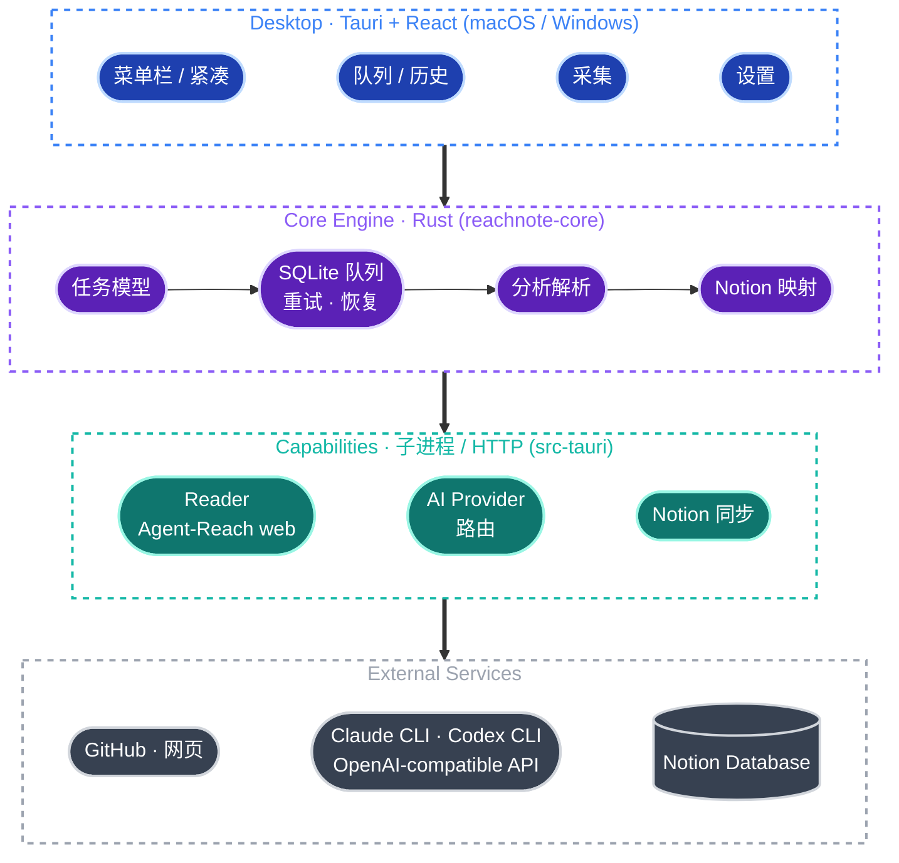
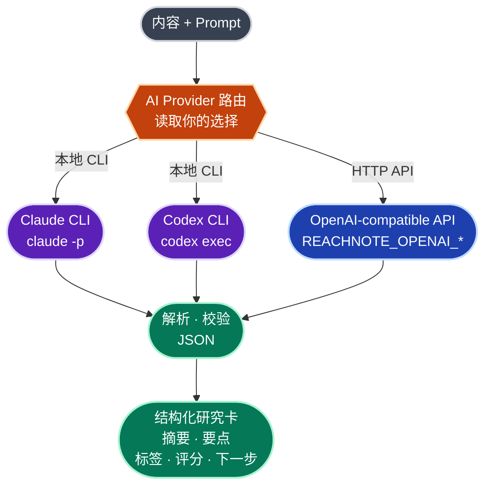
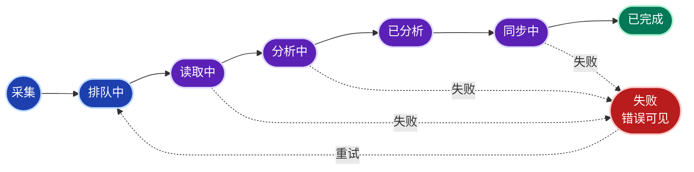
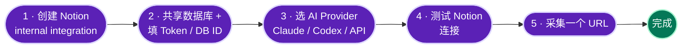

<h1 align="center">ReachNote</h1>

<p align="center"><b>AI-powered web capture for Notion</b></p>
<p align="center">把互联网内容变成可复用的 Notion 研究资产</p>

<p align="center">
  <a href="README.md">English</a> | <b>简体中文</b>
</p>

<p align="center">
  <a href="LICENSE"></a>
  
  
  
  <a href="https://github.com/Panniantong/Agent-Reach"></a>
  
  <a href="https://github.com/AliceDel66/ReachNote/releases"></a>
  <a href="https://github.com/AliceDel66/ReachNote/stargazers"></a>
</p>

> ReachNote 是一款**跨平台（macOS / Windows）桌面端 AI 信息采集工具**。你在浏览 GitHub、网页、视频、RSS 时收藏链接，本地 Agent 自动读取内容、调用 AI 总结分析，并写入你绑定的 Notion 数据库，形成一个可持续更新、可检索、可比较的个人研究库。

> [!NOTE]
> **项目状态：Alpha。** 核心闭环 —— 采集 → 读取 → AI 分析 → 同步 Notion —— 已端到端跑通，配套本地 SQLite 队列与一键重试。部分 P1 能力（Notion OAuth、全局快捷键、模板编辑、系统钥匙串、代码签名）尚未完成，见[路线图](#路线图)。可从 [Releases](https://github.com/AliceDel66/ReachNote/releases) 下载安装包，或从源码运行。

---

## 目录

- [ReachNote 是什么](#reachnote-是什么)
- [下载与安装](#下载与安装)
- [核心特性](#核心特性)
- [核心链路](#核心链路)
- [系统架构](#系统架构)
- [AI 分析：三种 Provider](#ai-分析三种-provider)
- [捕获方式](#捕获方式)
- [任务生命周期](#任务生命周期)
- [技术栈](#技术栈)
- [项目结构](#项目结构)
- [快速开始](#快速开始)
- [配置说明](#配置说明)
- [Notion 数据库结构](#notion-数据库结构)
- [内置 AI 模板](#内置-ai-模板)
- [路线图](#路线图)
- [隐私与数据](#隐私与数据)
- [致谢](#致谢)
- [参与贡献](#参与贡献)
- [License](#license)

---

## ReachNote 是什么

收藏一时爽，整理火葬场。ReachNote 想解决信息消费链路上的三个断点：

1. **看到好内容，但收藏后再也不整理。** 收藏夹变成数字垃圾场。
2. **AI 能总结内容，但缺少稳定的跨平台读取能力。** 复制粘贴正文太累，很多页面还读不到。
3. **Notion 是理想的长期知识库，但手动录入、分类、打标签太重。**

ReachNote 把这条链路自动化。它要做的不是「又一个收藏夹」，而是：

> **当我看到一个值得研究的链接时，我不用手动整理 —— 一步就把它变成一张结构化的 Notion 研究卡，方便我以后检索、比较和跟进。**

首版聚焦**开发者 / AI 工具研究者**：GitHub 仓库、技术博客、YouTube 教程、RSS 更新是高频且稳定的内容源，输出天然适合落进 Notion database（项目分析、技术栈、价值判断、是否跟进）。

---

## 下载与安装

预编译安装包发布在 [**Releases**](https://github.com/AliceDel66/ReachNote/releases) 页面，由 GitHub Actions 自动为两个平台构建：

| 平台 | 文件 | 说明 |
| --- | --- | --- |
| **macOS**（Apple Silicon + Intel） | `ReachNote_*_universal.dmg` | 一个通用包同时适配两种芯片 |
| **Windows**（x64） | `ReachNote_*_x64-setup.exe` / `*_x64_en-US.msi` | NSIS 安装器或 MSI |

> [!IMPORTANT]
> 当前安装包**未签名**（暂无 Apple / 微软证书），首次打开系统会告警，这在 Alpha 阶段属正常：
> - **macOS** —— 拖入「应用程序」后，右键图标 → **打开** → 再点一次 **打开**；或终端执行 `xattr -dr com.apple.quarantine /Applications/ReachNote.app`。
> - **Windows** —— SmartScreen 提示时点「**更多信息 → 仍要运行**」。

首次采集前需要**一个 AI 通道**（本地 `claude` / `codex` CLI，或 OpenAI 兼容 API）以及一个 **Notion Integration Token + Database ID**，详见[快速开始](#快速开始)。

---

## 核心特性

| 特性 | 状态 | 说明 |
| --- | --- | --- |
| 💻 **跨平台桌面** | ✅ | macOS 与 Windows，基于 Tauri 2，空闲占用低；支持「收进菜单栏」紧凑模式 |
| 🖱️ **一步捕获** | ✅ | 粘贴 URL 或从剪贴板一键读取；每次采集可附加备注 |
| 🌐 **网页 / 文章读取** | ✅ | 通过 [Agent-Reach](https://github.com/Panniantong/Agent-Reach) 的 web 路由（Jina Reader）读取正文，带来源识别 |
| 🤖 **结构化 AI 分析** | ✅ | 不只是摘要 —— 标题、摘要、关键要点、标签、价值评分、下一步，输出经 JSON 校验 |
| 🔌 **三种 AI Provider** | ✅ | 本地 **Claude CLI** / 本地 **Codex CLI** / 任意 **OpenAI 兼容 API**，自带算力、自带 Key |
| 🗂️ **直写 Notion** | ✅ | Integration Token + Database ID，自动映射字段，成功后回链页面 |
| 🔁 **本地队列与重试** | ✅ | 任务持久化在 SQLite；状态实时轮询；超时任务恢复为可重试的失败 |
| 🔐 **本地优先 / 隐私友好** | ✅ | 内容只流经「你的机器 → 你选的 AI → 你的 Notion」，无中间服务器 |
| ⌨️ **全局快捷键 / 剪贴板自动识别** | 🚧 | 规划中（P1） |
| 🔑 **Notion OAuth + 系统钥匙串** | 🚧 | 规划中；当前 Token 手动填写并存于本地 |

---

## 核心链路

ReachNote 的全部价值，是把每一个链接稳定地变成一张可用的 Notion 研究卡：

```mermaid
flowchart LR
    classDef io fill:#374151,stroke:#d1d5db,stroke-width:2px,color:#fff
    classDef capture fill:#1e40af,stroke:#bfdbfe,stroke-width:2px,color:#fff
    classDef read fill:#0f766e,stroke:#99f6e4,stroke-width:2px,color:#fff
    classDef ai fill:#5b21b6,stroke:#ddd6fe,stroke-width:2px,color:#fff
    classDef sync fill:#047857,stroke:#a7f3d0,stroke-width:2px,color:#fff

    URL((URL)):::io
    URL --> Capture(["1 · 采集<br/>剪贴板 / 手动"]):::capture
    Capture --> Detect(["2 · 识别来源<br/>GitHub · 网页"]):::capture
    Detect --> Read(["3 · 读取<br/>via Agent-Reach"]):::read
    Read --> Clean(["4 · 清洗<br/>提取 · 去噪"]):::read
    Clean --> Analyze(["5 · 分析<br/>AI Provider"]):::ai
    Analyze --> Map(["6 · 映射<br/>Notion 字段"]):::sync
    Map --> Sync(["7 · 同步<br/>写入 Notion"]):::sync
    Sync --> Done((完成)):::sync
```



> 设计原则：核心不是「能抓多少平台」，而是 `链接 → AI 分析 → Notion database` 这条闭环每一条都稳。

---

## 系统架构

ReachNote 是一个**本地优先**的跨平台桌面应用，分四层：



- **桌面层**（Tauri 2 + React 18 + Tailwind CSS）：队列（首屏）、采集、模板、设置，外加「收进菜单栏」紧凑模式。
- **核心引擎**（`crates/core`，Rust）：纯逻辑 —— 任务模型与状态、分析 JSON 解析与校验、Notion 字段映射，均带单测。
- **能力层**（`src-tauri`）：三个对外适配器 —— Reader（Agent-Reach web 路由）、AI Provider 路由（Claude / Codex / OpenAI 兼容）、Notion 同步，以及 SQLite 存储与 Tauri 命令。
- **外部服务**：内容源、AI 后端、你的 Notion 数据库，全部由你掌控。

---

## AI 分析：三种 Provider

ReachNote 的核心设计之一是**自带算力（Bring Your Own Compute）**。AI 分析不绑定任何单一厂商，三选一：



| Provider | 调用方式 | 适合场景 | 你需要准备 |
| --- | --- | --- | --- |
| **Claude CLI**（默认） | 本地子进程 `claude` | 已在用 Claude Code，想复用登录态与额度 | 安装并登录 [Claude Code CLI](https://claude.com/claude-code) |
| **Codex CLI** | 本地子进程 `codex exec` | 已在用 OpenAI Codex CLI | 安装并登录 [Codex CLI](https://github.com/openai/codex) |
| **OpenAI 兼容 API** | HTTP 请求 | 直连官方 / 代理 / 本地推理 | `REACHNOTE_OPENAI_BASE_URL` + `REACHNOTE_OPENAI_API_KEY` + `REACHNOTE_OPENAI_MODEL` |

> **为什么支持本地 CLI？** 很多开发者已经装好并登录了 Claude / Codex CLI。ReachNote 直接以子进程方式复用它们，你**无需再单独配置 API Key**，内容也不经第三方中转。OpenAI 兼容模式覆盖其余场景 —— 包括指向本地推理（Ollama `http://localhost:11434/v1`、LM Studio `http://localhost:1234/v1`）实现完全离线。

无论走哪条路，ReachNote 都向模型请求**同一套结构化输出**，解析后再校验，确保稳定映射到 Notion 字段。

---

## 捕获方式

| 方式 | 说明 | 状态 |
| --- | --- | --- |
| ⌨️ 手动粘贴 | 粘贴任意 http(s) 文章 URL，可附加备注 | ✅ P0 |
| 📋 剪贴板按钮 | 从剪贴板一键读取 URL | ✅ P0 |
| 🔥 全局快捷键 | 任意 App 下按快捷键捕获 | 🚧 P1 |
| 🌍 当前浏览器 URL | 抓取前台浏览器正在浏览的页面 | 🚧 P1 |

---

## 任务生命周期

每个采集任务在本地队列中按下列状态流转。**失败不会静默丢弃** —— 错误可读、可一键重试；卡在处理态超过超时的任务会被恢复为 `失败`：



> 采集提交在任务入队后立即返回；读取 + AI 分析在后台跑，队列每 ~1.2s 从本地 DB 轮询，状态始终真实。配置好 Notion 连接后，`已分析` 的任务会在下次队列刷新时自动同步。

---

## 技术栈

| 层 | 选型 |
| --- | --- |
| 应用外壳 | **Tauri 2**（跨平台 macOS / Windows） |
| 前端 | **React 18** + TypeScript + Vite |
| 样式 | **Tailwind CSS v4** + `lucide-react` 图标（自研组件） |
| 核心后端 | **Rust**（`reachnote-core`，带单测） |
| 持久化 | **SQLite**（`rusqlite`，bundled） |
| AI / 读取 | 子进程（`claude` / `codex` / `agent-reach`）+ HTTP（`reqwest`） |
| 分发 | Tauri bundler → `.dmg`（macOS）/ `.exe` + `.msi`（Windows） |

> **为什么是 Tauri 而非 Electron**：ReachNote 是常驻、可收进菜单栏的应用，对空闲内存敏感。Tauri 复用系统 WebView（macOS WKWebView / Windows WebView2），常驻进程比每个 app 自带 Chromium 的 Electron 轻得多。AI 与内容读取均通过 Rust 编排子进程与 HTTP 实现。

---

## 项目结构

```text
rearchnote/
├─ crates/core/src/          # reachnote-core：纯逻辑，带单测
│  ├─ analysis.rs            # 解析/校验 AI 输出 → 结构化研究卡
│  ├─ notion.rs              # Notion 字段映射
│  ├─ task.rs                # 任务模型与生命周期状态
│  └─ lib.rs
├─ src-tauri/src/            # Tauri 外壳 + 能力层
│  ├─ lib.rs                 # Tauri 命令与应用装配
│  ├─ provider.rs            # AI Provider：claude-cli / codex-cli / openai-compatible
│  ├─ reader.rs              # Agent-Reach / 网页读取
│  ├─ notion.rs              # Notion HTTP 同步
│  └─ store.rs               # SQLite 任务队列 + 设置
├─ src/                      # React + Tailwind 前端（队列优先）
│  └─ App.tsx
├─ .github/workflows/        # release.yml —— macOS + Windows 安装包 CI
├─ Cargo.toml                # Rust workspace（crates/core + src-tauri）
└─ package.json              # 前端依赖 + Tauri CLI
```

---

## 快速开始

### 环境要求

- **Rust**（stable）与 **Node 18+** + **pnpm**
- 至少一种 AI Provider：本地 `claude` / `codex` CLI，或一个 OpenAI 兼容 API（`REACHNOTE_OPENAI_*`）
- 内容读取：`PATH` 上可用的 [Agent-Reach](https://github.com/Panniantong/Agent-Reach)（`agent-reach` CLI）
- 一个 Notion **内部集成（internal integration）**（写入用）

### 从源码运行

```bash
git clone git@github.com:AliceDel66/ReachNote.git
cd ReachNote
pnpm install
pnpm tauri dev
```

### 构建安装包

```bash
pnpm tauri build        # 为当前系统本地构建
```

或推送一个 `v*` 标签 —— [`release.yml`](.github/workflows/release.yml) 工作流会构建 macOS（通用）与 Windows 安装包并附加到 GitHub Release。

### 首次配置

目标：**几分钟内完成第一次可用闭环。**



1. **创建 Notion 内部集成** —— <https://www.notion.so/my-integrations> → 复制 *Internal Integration Secret*（`ntn_...`）。
2. **把目标数据库共享给该集成**，然后在 ReachNote → 设置里粘贴 **Token** 与 **Database ID** 并保存。
3. **选择 AI Provider** —— Claude CLI（默认）、Codex CLI，或 OpenAI 兼容。
4. **在设置里测试 Notion 连接**。
5. **采集一个 URL** —— 粘贴一条文章链接，确认整条链路（读取 → 分析 → 同步）跑通。

---

## 配置说明

大多数配置都在应用内 **设置** 页完成，无需手写文件：

- **AI Provider** —— 每次采集时选择 / 在设置里切换（`claude_cli` · `codex_cli` · `openai_compatible`）。
- **Notion** —— Integration Token + Database ID，保存在本地存储（钥匙串托管规划中）。
- **OpenAI 兼容** —— 当前从环境变量读取：

```bash
export REACHNOTE_OPENAI_BASE_URL="https://api.openai.com/v1"   # 或 http://localhost:11434/v1
export REACHNOTE_OPENAI_API_KEY="sk-..."
export REACHNOTE_OPENAI_MODEL="gpt-4o-mini"
```

> 切勿提交真实 Token。`.env*` 文件已被 gitignore；Notion 自检模板见 `.env.notion.example`。

---

## Notion 数据库结构

把 ReachNote 指向一个字段与下表匹配的数据库。同步时会写入这 **13 个属性**（名称与类型需一致）：

| 字段 | 类型 | 说明 |
| --- | --- | --- |
| `Title` | Title | 内容标题 |
| `URL` | URL | 原始链接 |
| `Source Type` | Select | `GitHub` / `Article` / … |
| `Summary` | Text | AI 摘要 |
| `Key Points` | Text | 关键要点（换行拼接） |
| `Tags` | Multi-select | 自动打标 |
| `Status` | Select | 写入时置为 `Inbox`，之后手动推进 |
| `Score` | Number | 价值评分 `0–100`（由 1–5 星 ×20 得到） |
| `Captured At` | Date | 采集时间 |
| `Synced At` | Date | 写入时间 |
| `AI Model` | Text | 实际使用的模型 / Provider |
| `Template` | Select | 使用的分析模板 |
| `Next Action` | Text | 下一步建议 |

> 默认 database 为 **`ReachNote Research Inbox`**。`Status` 同时充当你手动维护的内容生命周期（`Inbox` / `Reviewing` / `Follow-up` / `Archived`）。

---

## 内置 AI 模板

模板决定 AI 输出的结构。首版以 **文章精读** 为可用预览，其余在「模板」页作为方向展示（编辑 / 选择为 P1）：

| 模板 | 适用来源 | 输出字段 | 状态 |
| --- | --- | --- | --- |
| **文章精读** | 博客 / 网页 | 摘要 · 关键要点 · 标签 · 评分 · 下一步 | ✅ 预览 |
| **GitHub 项目分析** | GitHub repo | 定位 · 技术栈 · 亮点 · 风险 | 🚧 计划中 |
| **视频笔记** | YouTube 字幕 | 主题 · 关键要点 · 片段 | 🚧 计划中 |
| **RSS Brief** | RSS / 订阅 | 更新摘要 · 为什么值得看 · 标签 | 🚧 计划中 |

---

## 路线图

### P0 — MVP 闭环 ✅

- [x] AI Provider 抽象（Claude CLI / Codex CLI / OpenAI 兼容 API）+ 单元测试
- [x] 来源识别（GitHub / 网页）与分析解析
- [x] 手动 / 剪贴板按钮 URL 采集
- [x] Agent-Reach 读取（web 路由 / Jina Reader）
- [x] Notion 写入（Integration Token + Database ID，最小同步）
- [x] 本地任务队列 + 失败重试 + 超时恢复

### P1 — 体验增强

- [ ] Notion OAuth（替换手动 Token）+ 系统钥匙串凭证存储
- [ ] 全局快捷键 / 当前浏览器 URL / 剪贴板自动识别
- [ ] 模板选择 + 按来源路由
- [ ] 在设置界面配置 OpenAI 兼容 API（当前走环境变量）
- [ ] 代码签名 / 公证，产出已签名安装包

### P2 — 持续监控

- [ ] RSS 定时监控 / GitHub repo watch
- [ ] 周报 / 月报生成
- [ ] 自定义 Notion 字段映射
- [ ] 社交平台登录态渠道（小红书 / Twitter / Reddit 等，Agent-Reach 已支持）

> 首版**刻意不做**：社交平台大规模采集、团队协作知识库、自建云端内容库、完整 RAG 搜索、Notion 双向同步、复杂模板编辑器。

---

## 隐私与数据

ReachNote 是**本地优先**的开源工具，没有云端账号，也没有 ReachNote 自己的服务器。

- **内容只流经三方：** 你的机器 → 你选的 AI Provider → 你的 Notion。中间无第三方中转。
- **自带 Key（BYOK）：** Notion 与 API 凭证留在本地（当前为本地存储，钥匙串托管规划中），不上传。
- **可完全离线：** 选择本地 CLI 或本地推理（Ollama / LM Studio）时，内容不出本机。
- **失败可见：** 任务与错误都落在本地，绝不静默丢弃。

---

## 致谢

ReachNote 站在这些项目的肩膀上：

- **[Agent-Reach](https://github.com/Panniantong/Agent-Reach)** —— 跨平台内容读取层，ReachNote 通过它「看见互联网」。
- **[Tauri](https://tauri.app)** —— 跨平台桌面外壳。
- **[React](https://react.dev)** + **[Tailwind CSS](https://tailwindcss.com)** + **[lucide](https://lucide.dev)** —— 前端。

---

## 参与贡献

ReachNote 处于早期阶段，**正是参与塑造它的最佳时机**。

- 💡 想法 / 用例 / 内容源需求 → 开 [Discussion](https://github.com/AliceDel66/ReachNote/discussions)
- 🐛 问题 / 设计漏洞 → 提 [Issue](https://github.com/AliceDel66/ReachNote/issues)
- 🔧 想写代码 → 关注路线图 P1，欢迎认领

---

## License

本项目以 **[MIT License](LICENSE)** 开源 —— 自由使用、修改、分发。

---

<p align="center">
  <sub>Built for people who collect more than they read.</sub><br/>
  <sub>ReachNote · <a href="https://github.com/AliceDel66/ReachNote">github.com/AliceDel66/ReachNote</a></sub>
</p>
