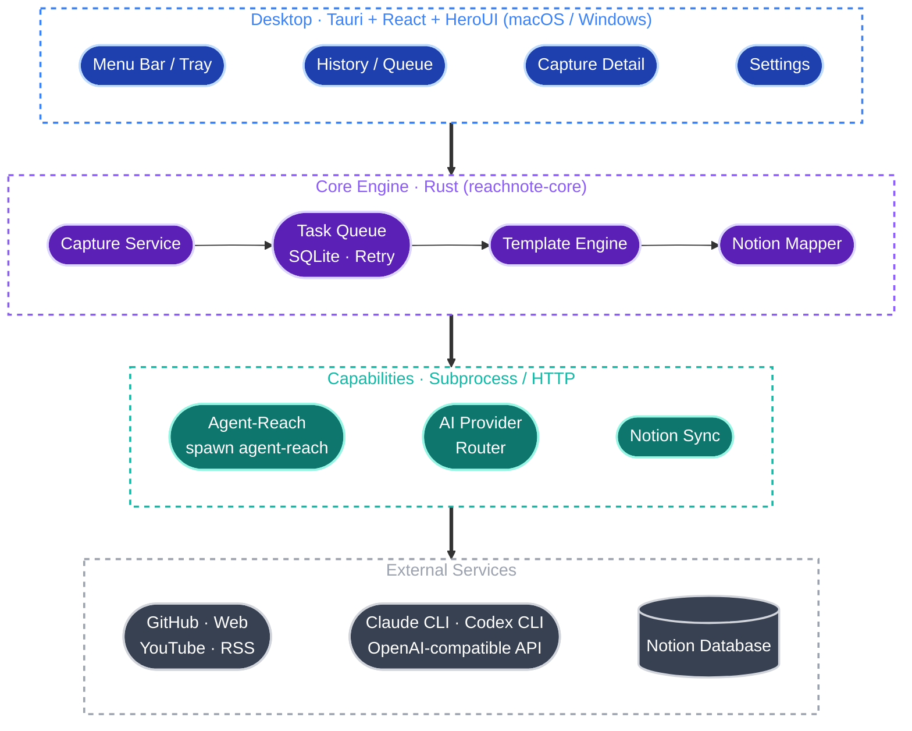
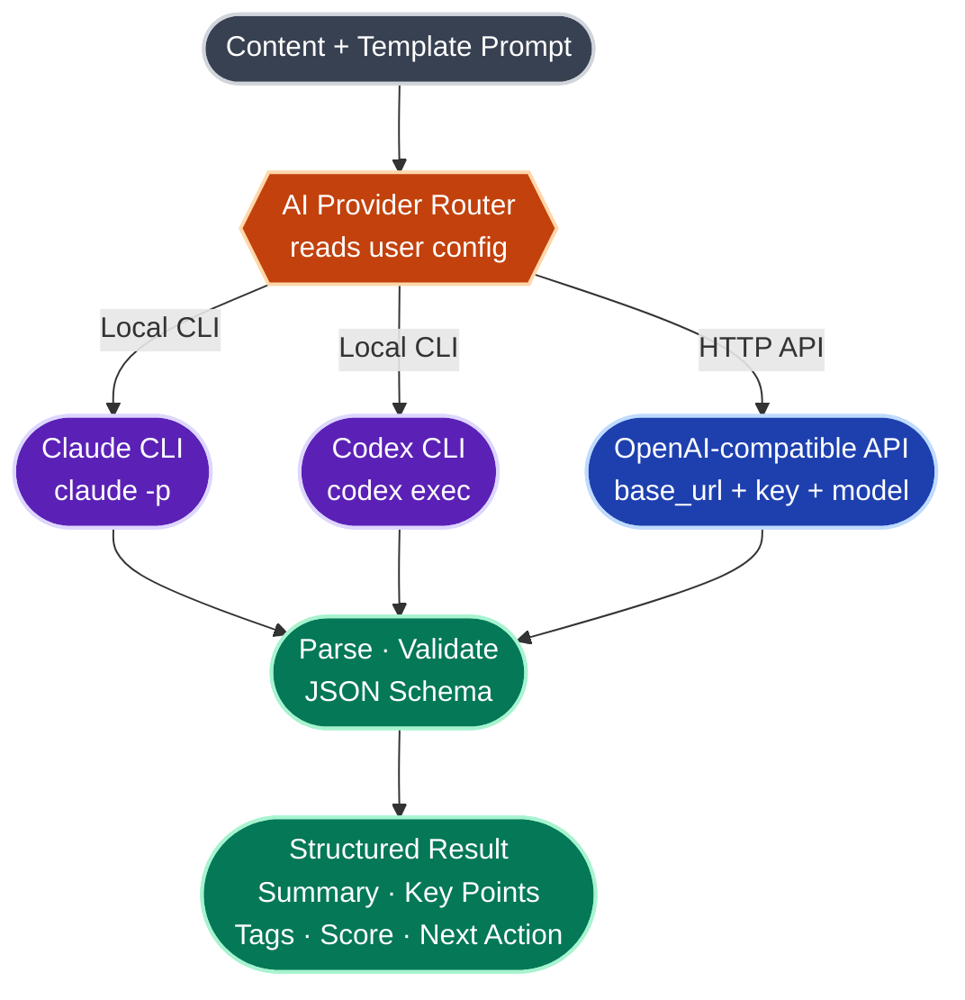
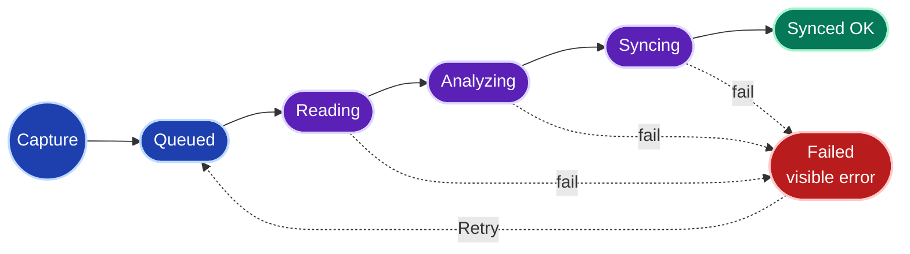
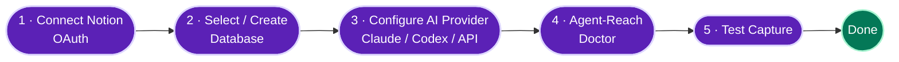

<h1 align="center">ReachNote</h1>

<p align="center"><b>AI-powered web capture for Notion</b></p>
<p align="center">把互联网内容变成可复用的 Notion 研究资产</p>

<p align="center">
  <a href="README.md">English</a> | <b>简体中文</b>
</p>

<p align="center">
  <a href="LICENSE"></a>
  
  
  <a href="https://heroui.com"></a>
  <a href="https://github.com/Panniantong/Agent-Reach"></a>
  
  <a href="https://github.com/AliceDel66/ReachNote/stargazers"></a>
</p>

> ReachNote 是一款**跨平台（macOS / Windows）桌面端 AI 信息采集工具**。你在浏览 GitHub、网页、视频、RSS 时一键收藏链接，本地 Agent 自动读取内容、调用 AI 总结分析，并写入你绑定的 Notion 数据库，形成一个可持续更新、可检索、可比较的个人研究库。

> [!NOTE]
> **项目状态：早期开发中（Pre-Alpha）。** 产品定位、信息架构、技术栈已收敛，核心代码正在开发。目前已可跑通 P0 竖切（URL → AI 分析 → 结构化研究卡）。下文标注「拟定 / 开发中」的部分代表目标形态，尚未完全落地。

---

## 目录

- [ReachNote 是什么](#reachnote-是什么)
- [核心特性](#核心特性)
- [核心链路](#核心链路)
- [系统架构](#系统架构)
- [AI 分析：三种 Provider](#ai-分析三种-provider)
- [捕获方式](#捕获方式)
- [任务生命周期](#任务生命周期)
- [技术栈](#技术栈)
- [项目结构](#项目结构)
- [快速开始](#快速开始)
- [配置说明](#配置说明)
- [Notion 数据库结构](#notion-数据库结构)
- [内置 AI 模板](#内置-ai-模板)
- [路线图](#路线图)
- [隐私与数据](#隐私与数据)
- [致谢](#致谢)
- [参与贡献](#参与贡献)
- [License](#license)

---

## ReachNote 是什么

收藏一时爽，整理火葬场。ReachNote 想解决信息消费链路上的三个断点：

1. **看到好内容，但收藏后再也不整理。** 收藏夹变成数字垃圾场。
2. **AI 能总结内容，但缺少稳定的跨平台读取能力。** 复制粘贴正文太累，很多页面还读不到。
3. **Notion 是理想的长期知识库，但手动录入、分类、打标签太重。**

ReachNote 把这条链路自动化。它要做的不是「又一个收藏夹」，而是：

> **当我看到一个值得研究的链接时，我不用手动整理 —— 只需一个快捷键，它就自动生成一张结构化的 Notion 研究卡，方便我以后检索、比较和跟进。**

首版聚焦**开发者 / AI 工具研究者**：GitHub 仓库、技术博客、YouTube 教程、RSS 更新是高频且稳定的内容源，输出天然适合落进 Notion database（项目分析、技术栈、价值判断、是否跟进）。

---

## 核心特性

| 特性 | 说明 |
| --- | --- |
| 💻 **跨平台桌面** | macOS 与 Windows，系统托盘 / 菜单栏常驻，基于 Tauri，空闲占用低 |
| 🖱️ **一键捕获** | 剪贴板 URL、手动粘贴、全局快捷键（规划中） |
| 🌐 **多源读取** | 通过 [Agent-Reach](https://github.com/Panniantong/Agent-Reach) 读取 GitHub / 网页 / YouTube 字幕 / RSS，正文提取 + 去噪 |
| 🤖 **AI 模板化分析** | 不只是摘要，而是按内容类型输出结构化字段：定位、技术栈、关键观点、价值评分、下一步建议 |
| 🔌 **三种 AI Provider** | 本地 **Claude CLI** / 本地 **Codex CLI** / 任意 **OpenAI 兼容 API**，自带算力、自带 Key |
| 🗂️ **直写 Notion** | OAuth 授权，自动映射字段并写入你选定的 database |
| 🔁 **本地队列与重试** | 任务持久化在本地，失败原因人类可读、可一键重试 |
| 🔐 **本地优先 / 隐私友好** | 内容只流经「你的机器 → 你选的 AI → 你的 Notion」，无中间服务器 |
| 🆓 **开源 / BYOK** | MIT 协议，无云端账号、无订阅，自带 Key 即用 |

---

## 核心链路

ReachNote 的全部价值，是把每一个链接稳定地变成一张可用的 Notion 研究卡：

```mermaid
flowchart LR
    classDef io fill:#374151,stroke:#d1d5db,stroke-width:2px,color:#fff
    classDef capture fill:#1e40af,stroke:#bfdbfe,stroke-width:2px,color:#fff
    classDef read fill:#0f766e,stroke:#99f6e4,stroke-width:2px,color:#fff
    classDef ai fill:#5b21b6,stroke:#ddd6fe,stroke-width:2px,color:#fff
    classDef sync fill:#047857,stroke:#a7f3d0,stroke-width:2px,color:#fff

    URL((URL)):::io
    URL --> Capture(["1 · Capture<br/>Clipboard / Hotkey / Manual"]):::capture
    Capture --> Detect(["2 · Detect Source<br/>GitHub · Web · Video · RSS"]):::capture
    Detect --> Read(["3 · Read<br/>via Agent-Reach"]):::read
    Read --> Clean(["4 · Clean<br/>Extract · Denoise"]):::read
    Clean --> Analyze(["5 · Analyze<br/>AI Template"]):::ai
    Analyze --> Map(["6 · Map<br/>Notion Fields"]):::sync
    Map --> Sync(["7 · Sync<br/>Write to Notion"]):::sync
    Sync --> Done((Done)):::sync
```



> 设计原则：核心不是「能抓多少平台」，而是 `GitHub / 网页 / YouTube → AI 模板 → Notion database` 这条闭环每一条都稳。

---

## 系统架构

ReachNote 是一个**本地优先**的跨平台桌面应用，分四层：



- **桌面层**（Tauri + React + HeroUI）：菜单栏 / 托盘、History / Queue、Capture Detail、Settings。首屏直接展示 History / Queue。
- **核心引擎**（Rust）：本地任务编排。捕获服务接单 → 队列持久化与重试 → 模板引擎组装 prompt → Notion 映射器对齐字段。
- **能力层**：三个对外适配器 —— Agent-Reach（spawn `agent-reach` 读内容）、AI Provider 路由（做分析）、Notion Sync（写卡片）。
- **外部服务**：内容源、AI 后端、你的 Notion 数据库，全部由你掌控。

---

## AI 分析：三种 Provider

ReachNote 的核心设计之一是**自带算力（Bring Your Own Compute）**。AI 分析不绑定任何单一厂商，三选一：



| Provider | 调用方式 | 适合场景 | 你需要准备 |
| --- | --- | --- | --- |
| **Claude CLI** | 本地子进程 `claude -p` | 已在用 Claude Code，想复用登录态与额度 | 安装并登录 [Claude Code CLI](https://claude.com/claude-code) |
| **Codex CLI** | 本地子进程 `codex exec` | 已在用 OpenAI Codex CLI | 安装并登录 [Codex CLI](https://github.com/openai/codex) |
| **OpenAI 兼容 API** | HTTP 请求 | 直连官方 / 代理 / 本地推理 | `base_url` + `api_key` + `model` |

> **为什么支持本地 CLI？** 很多开发者已经装好并登录了 Claude / Codex CLI。ReachNote 直接以子进程方式复用它们，你**无需再单独配置 API Key**，内容也不经第三方中转。OpenAI 兼容模式覆盖其余场景 —— 包括指向本地推理（Ollama `http://localhost:11434/v1`、LM Studio `http://localhost:1234/v1`）实现完全离线。

无论走哪条路，ReachNote 都向模型请求**同一套结构化输出**，并按 JSON Schema 校验，确保稳定映射到 Notion 字段。配置示例见 [配置说明](#配置说明)。

---

## 捕获方式

| 方式 | 说明 | 优先级 |
| --- | --- | --- |
| 📋 剪贴板 URL | 识别剪贴板里的链接，一键捕获 | P0 |
| ⌨️ 手动粘贴 | 在弹窗里粘贴任意 URL | P0 |
| 🔥 全局快捷键 | 任意 App 下按快捷键捕获 | P1 |
| 🌍 当前浏览器 URL | 抓取前台浏览器正在浏览的页面 | P1 |

---

## 任务生命周期

每个捕获任务在本地队列中按下列状态流转。**失败不会静默丢弃**，错误可读、可一键重试：



> 区分两套状态：上图是 **应用内任务处理状态**；写入 Notion 后，研究卡还有一套**内容生命周期状态**（`Inbox / Reviewing / Follow-up / Archived`），由你在 Notion 里手动推进。

---

## 技术栈

技术选型已定板（跨平台 + 常驻 + 指定 HeroUI 三个约束共同决定）：

| 层 | 选型 |
| --- | --- |
| 应用外壳 | **Tauri 2**（跨平台 macOS / Windows） |
| 前端 | **React 18** + TypeScript + Vite |
| UI 组件 | **HeroUI** + Tailwind CSS |
| 核心后端 | **Rust**（`reachnote-core`，已单元测试） |
| 持久化 | SQLite |
| 凭证存储 | 操作系统钥匙串（keyring） |
| 分发 | Tauri bundler → `.dmg` / `.msi` |

> **为什么是 Tauri 而非 Electron**：ReachNote 是常驻托盘应用，对空闲内存敏感。Tauri 复用系统 WebView（macOS WKWebView / Windows WebView2），常驻进程比每个 app 自带 Chromium 的 Electron 轻得多。**前端锁定 React** 是因为 HeroUI 是 React 组件库。AI 与内容读取均通过 Rust 编排子进程（`agent-reach` / `claude` / `codex`）与 HTTP 实现。

---

## 项目结构

```text
rearchnote/
├─ crates/core/        # reachnote-core：纯逻辑核心（Rust，已单测）
│  └─ src/
│     ├─ ai/           # AI Provider 抽象：claude-cli / codex-cli / openai-api + 结构化解析
│     └─ reach.rs      # 封装对 Agent-Reach CLI 的调用
├─ src-tauri/          # Tauri 应用外壳：capture command、托盘、持久化
├─ src/                # React + HeroUI 前端（最小 Capture 界面）
├─ Cargo.toml          # Rust workspace
└─ package.json        # 前端依赖 + Tauri CLI
```

---

## 快速开始

> [!IMPORTANT]
> 早期阶段。当前已可跑通 **P0 竖切**：输入 URL（或直接粘贴正文）→ 调用 AI Provider → 返回结构化研究卡。Notion 写入、托盘、队列持久化仍在开发中。

### 环境要求

- **Rust**（stable）与 **Node 18+** / **pnpm**
- 至少一种 AI Provider：本地 `claude` / `codex` CLI，或一个 OpenAI 兼容 API 的 `base_url` + `api_key`
- 内容读取：[Agent-Reach](https://github.com/Panniantong/Agent-Reach)（`agent-reach` CLI；Windows 需 Python 运行时）
- 一个 Notion 账号（写入用，开发中）

### 运行

```bash
git clone git@github.com:AliceDel66/ReachNote.git
cd ReachNote
pnpm install
pnpm tauri dev
```

### 首次配置（Onboarding）

目标：**2 分钟内完成第一次可用闭环。**



1. **连接 Notion** —— OAuth 授权访问目标 workspace。
2. **选择或创建 Database** —— 选已有库，或一键创建默认的 `ReachNote Research Inbox`。
3. **配置 AI Provider** —— 三选一。
4. **运行 Agent-Reach Doctor** —— 即 `agent-reach doctor`，体检读取渠道。
5. **测试一次 Capture** —— 收一条 GitHub repo，确认整条链路通畅。

---

## 配置说明

> 以下为**设计中的配置形态**（拟定路径 `~/.reachnote/config.toml`）。多数用户可在 Settings 界面完成，无需手写。

```toml
[ai]
# 三选一：claude-cli | codex-cli | openai-api
provider = "claude-cli"

[ai.claude-cli]
command = "claude"        # 复用已登录的 Claude Code

[ai.codex-cli]
command = "codex"

[ai.openai-api]
base_url = "https://api.openai.com/v1"   # 本地推理改为 http://localhost:11434/v1 等
api_key  = "sk-..."
model    = "gpt-4o-mini"

[reach]
command = "agent-reach"   # Agent-Reach CLI
sources = ["github", "web", "youtube", "rss"]

[notion]
# 由 OAuth 流程自动写入
database_id = "xxxxxxxx-xxxx-xxxx-xxxx-xxxxxxxxxxxx"
default_template = "github-project"
```

---

## Notion 数据库结构

默认 database：**`ReachNote Research Inbox`**

| 字段 | 类型 | 说明 |
| --- | --- | --- |
| `Title` | Title | 内容标题 |
| `URL` | URL | 原始链接 |
| `Source Type` | Select | `GitHub` / `Article` / `Video` / `RSS` / `Social` |
| `Summary` | Text | AI 摘要 |
| `Key Points` | Text | 关键观点 |
| `Tags` | Multi-select | 自动打标 |
| `Status` | Select | `Inbox` / `Reviewing` / `Follow-up` / `Archived` |
| `Score` | Number | 价值评分（0-100） |
| `Captured At` | Date | 捕获时间 |
| `Synced At` | Date | 写入时间 |
| `AI Model` | Text | 实际使用的模型 / Provider |
| `Template` | Select | 使用的分析模板 |
| `Raw Content` | Text | 清洗后的原文 |
| `Next Action` | Text | 下一步建议 |

---

## 内置 AI 模板

模板决定 AI 输出的结构。首版内置 4 个，按来源自动选择，也可手动指定（P1）：

| 模板 | 适用来源 | 输出字段 |
| --- | --- | --- |
| **GitHub 项目分析** | GitHub repo | 项目定位 · 核心功能 · 技术栈 · 适用场景 · 亮点 · 风险 · 是否值得跟进 |
| **文章精读** | 博客 / 网页 | 一句话摘要 · 关键观点 · 证据 · 可复用结论 · 标签 |
| **视频笔记** | YouTube 字幕 | 主题 · 章节摘要 · 关键观点 · 行动项 · 适合谁看 |
| **RSS Brief** | RSS / 订阅 | 更新摘要 · 为什么值得看 · 归类标签 · 是否需要后续阅读 |

---

## 路线图

### P0 — MVP 闭环

- [x] AI Provider 抽象（Claude CLI / Codex CLI / OpenAI 兼容 API）+ 单元测试
- [x] 来源识别与模板路由
- [ ] Notion OAuth 绑定 + Database 选择 / 创建
- [ ] 手动 / 剪贴板 URL 捕获
- [ ] Agent-Reach 读取接入（对齐真实子命令）
- [ ] Notion 写入
- [ ] 本地任务队列与失败重试

### P1 — 体验增强

- [ ] 全局快捷键 / 当前浏览器 URL 捕获
- [ ] 模板选择
- [ ] Agent-Reach Doctor 可视化
- [ ] 批量处理

### P2 — 持续监控

- [ ] RSS 定时监控 / GitHub repo watch
- [ ] 周报 / 月报生成
- [ ] 自定义 Notion 字段映射
- [ ] 社交平台登录态渠道（小红书 / Twitter / Reddit 等，Agent-Reach 已支持）

> 首版**刻意不做**：社交平台大规模采集、团队协作知识库、自建云端内容库、完整 RAG 搜索、Notion 双向同步、复杂模板编辑器。

---

## 隐私与数据

ReachNote 是**本地优先**的开源工具，没有云端账号，也没有 ReachNote 自己的服务器。

- **内容只流经三方：** 你的机器 → 你选的 AI Provider → 你的 Notion。中间无第三方中转。
- **自带 Key（BYOK）：** API Key 与 Notion 凭证存在本地操作系统钥匙串，不上传。
- **可完全离线：** 选择本地 CLI 或本地推理（Ollama / LM Studio）时，内容不出本机。
- **失败可见：** 任务与错误都落在本地，绝不静默丢弃。

---

## 致谢

ReachNote 站在这些项目的肩膀上：

- **[Agent-Reach](https://github.com/Panniantong/Agent-Reach)** —— 跨平台内容读取层，ReachNote 通过它"看见互联网"（GitHub / 网页 / YouTube / RSS 等）。
- **[HeroUI](https://heroui.com)** —— React UI 组件库。
- **[Tauri](https://tauri.app)** —— 跨平台桌面外壳。

---

## 参与贡献

ReachNote 处于早期阶段，**正是参与塑造它的最佳时机**。

- 💡 想法 / 用例 / 内容源需求 → 开 [Discussion](https://github.com/AliceDel66/ReachNote/discussions)
- 🐛 问题 / 设计漏洞 → 提 [Issue](https://github.com/AliceDel66/ReachNote/issues)
- 🔧 想写代码 → 关注路线图 P0，欢迎认领

---

## License

本项目计划以 **[MIT License](LICENSE)** 开源 —— 无商业化计划，自由使用、修改、分发。

---

<p align="center">
  <sub>Built for people who collect more than they read.</sub><br/>
  <sub>ReachNote · <a href="https://github.com/AliceDel66/ReachNote">github.com/AliceDel66/ReachNote</a></sub>
</p>
